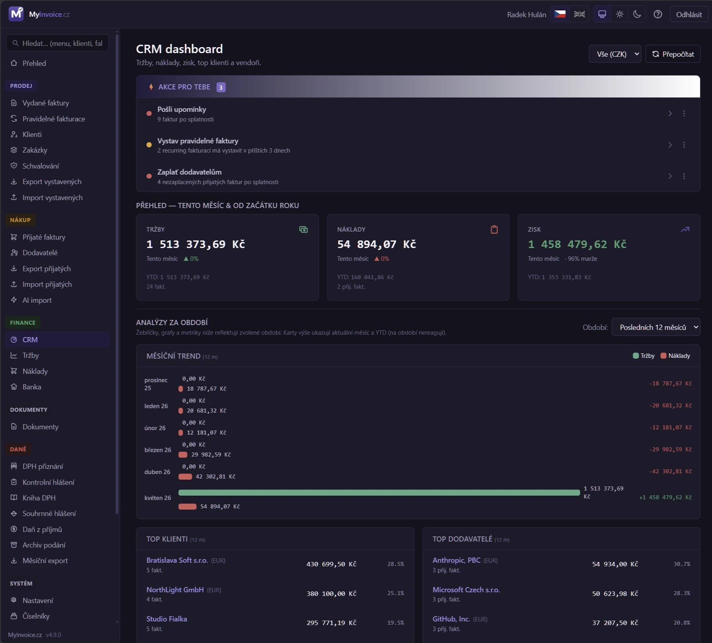

# 20. CRM dashboard

CRM (Customer Relationship Management) v MyInvoice.cz je BI/analytický modul nad tržbami, náklady a klienty. Najdeš ho v menu **Finance → CRM**.

>
## Co CRM zobrazuje

### KPI karty (top of dashboard)

- **Tržby tento měsíc** — z vydaných faktur (status ∈ issued/sent/reminded/paid, ne proformy)
- **Náklady tento měsíc** — z přijatých faktur (status ∈ received/booked/paid)
- **Zisk** — tržby − náklady (s color coding: zelený pokud kladný, červený jinak)

> [!NOTE]
> Tržby, náklady a zisk se u **plátce DPH** počítají **bez DPH** (DPH je průběžná
> položka, která se odvádí/odpočítává) — stejně jako na stránkách Tržby a Náklady,
> takže čísla mezi sekcemi sedí. U neplátce jsou částky včetně DPH. Naopak
> peněžní toky (cash-flow „Co přiteče/odteče", pohledávky a závazky po splatnosti)
> zůstávají **včetně DPH** — to jsou reálné částky převodů.

Každá karta kromě hodnoty za tento měsíc (a trendu ▲/▼ vs minulý měsíc) ukazuje i **posledních 12 měsíců** (klouzavě) a **YTD** (od začátku roku), a u obou **meziroční změnu v %** — 12 měsíců proti předchozím 12 měsícům a YTD proti stejnému období loni (u nákladů je růst červený, u tržeb a zisku zelený). Karta Zisk navíc zobrazuje marži YTD. Tyto hodnoty jsou nezávislé na přepínači období níže.

### Srovnání období

Tabulka **Tržby / Náklady / Zisk / Marže** pro pět období vedle sebe: tento měsíc, minulý měsíc, posledních 12 měsíců, letos (YTD) a loňský rok. Částky tržeb a nákladů jsou prokliknutelné — vedou na seznam vydaných, resp. přijatých faktur filtrovaný na dané období (viz [Proklik do faktur](#proklik-do-faktur)).

### Grafy zisku

Stejné dva grafy jako na stránkách Tržby a Náklady, ale pro **zisk**:

- **Zisk za posledních 12 měsíců** — sloupcový graf (klouzavé okno) s linkou téhož období o rok dříve; ztrátové měsíce jdou pod nulu.
- **Kumulativní zisk YTD vs. loni** — narůstající křivka od ledna, porovnaná s předchozím rokem do stejného dne; ztráta kumulaci snižuje.

### Monthly trend chart

Bar chart pro posledních 12 měsíců:
- Zelený bar = tržby
- Červený bar = náklady
- Pravý sloupec = zisk per měsíc (s ↑/↓ indikací)

### Top klienti + Top vendoři

Pareto ranking — kdo dělá nejvíc revenue, kdo největší náklady. Včetně **percent_share** (jaký % z celkového objemu daného currency).

### Pohledávky a závazky (Aging buckets)

Distribuce nezaplacených faktur do skupin:
- **V termínu** (still not due)
- **1-30 dní po splatnosti**
- **31-60 dní**
- **61-90 dní**
- **90+ dní** (red)

Pro vystavené (pohledávky) i přijaté (závazky), per currency.

### Health metrics

- **DSO (Days Sales Outstanding)** — průměrná doba inkasa (paid_at − issue_date) za posledních 12 měsíců
- **Platební morálka** — % faktur zaplacených včas vs po splatnosti
- **Riziko koncentrace** — kolik % tržeb dělá Top 1 klient + risk level (low <25%, medium <40%, high >40%) + Pareto count (kolik klientů dělá 80%)
- **DPO (Days Payable Outstanding)** — průměrná doba úhrady dodavatelům (paid_at − issue_date u přijatých faktur), protějšek DSO
- **Koncentrace dodavatelů** — kolik % nákladů dělá Top 1 dodavatel + risk level + Pareto count (závislost na klíčových dodavatelích)
- **Pracovní kapitálový cyklus** — DSO − DPO; kladný = financuješ provoz (inkasuješ pomaleji, než platíš), záporný = dodavatelé tě financují

### Náklady podle kategorií

Pie chart (nebo bar) s rozpadem nákladů per `expense_categories`. Pokud nemáš kategorie přiřazené, vidíš jeden bar "Bez kategorie" — doporučujeme přiřadit (Číselníky → Kategorie nákladů).

### Tržby podle kategorií

Symetrický rozpad tržeb per `revenue_categories` (tabulka v CRM dashboardu, koláčový graf na stránce **Tržby**, rolling 12 měsíců, přepočet na CZK). Kategorii tržby vybíráš na vydané faktuře; výchozí kategorii lze přednastavit na **zákazníkovi** i na **zakázce** (zakázka má přednost) a spravuje se v **Číselníky → Kategorie tržeb**. Výchozí kategorie se aplikuje i u importovaných, pravidelných a z proformy vyúčtovaných faktur.

### Churn risk

Klienti, kteří **60+ dní nemají objednávku**. Pro každého: poslední faktura, počet dní bez objednávky (color coded: >180 red, >90 warning), kumulativní revenue. Click na klienta → /clients/{id}.

### Tabulky po rocích a měsících

Dvojice tabulek **Náklady po rocích / po měsících** (jen přijaté faktury) a **Zisk po rocích / po měsících** (tržby, zisk a marže — výsledovka). Tabulky „po měsících" respektují přepínač období, „po rocích" ukazují všechny roky s aktivitou.

### Proklik do faktur

Tabulky CRM jsou prokliknutelné a otevřou příslušný seznam faktur s předvyplněným filtrem v URL (rok, měsíc, případně rozsah datumů):

- **Náklady po rocích / po měsících** → klik na řádek otevře **přijaté faktury** filtrované na daný rok, resp. rok + měsíc.
- **Zisk po rocích / po měsících** → klik na tržbu otevře **vydané faktury** za daný rok, resp. měsíc.
- **Srovnání období** → tržba vede na vydané faktury, náklad na přijaté faktury za dané období.

## Filtry

- **Period**: 3 / 6 / 12 / 24 měsíců zpět
- **Currency**: pokud máš víc měn, picker s volbou **„Vše (CZK)"** (výchozí) — boxy Přehled i měsíční graf sečtou všechny měny přepočtené na CZK; nebo konkrétní měna (nativní částky). Chybějící data za zvolenou měnu se ukážou jako 0 (ne částka jiné měny).

## Jak data fungují

CRM počítá **živě** z `invoices` / `purchase_invoices` — stejnou metodikou jako stránky Tržby a Náklady (tržby bez DPH pro plátce podle DUZP s fallbackem na datum vystavení; náklady bez DPH pro plátce, se správným vyřazením spárovaných/zaplacených záloh). Díky tomu vidíš okamžitě aktuální stav a čísla sedí s ostatními sekcemi Finance napříč libovolným obdobím (i staršími roky).

## Tipy pro lepší přehled

1. **Přiřazuj expense categories** k přijatým fakturám → Náklady podle kategorií ukáže smysluplný rozpad
2. **Plnit VAT klasifikační kódy** (auto-default už řeší 99% případů) → DPH report v sekci Daně bude přesnější
3. **Vyrovnávat bank statements** → DSO bude přesné (paid_at = datum úhrady)
4. **Pravidelné faktury** (`/recurring`) — predikovatelné MRR, plánujeme zobrazit v dalším iter

## CRM vs. Tržby vs. Náklady

V menu **Finance** najdeš vedle CRM ještě dvě podrobnější stránky, které mají v manuálu vlastní kapitoly:

| Stránka | Co dělá | Pro koho |
|---|---|---|
| **CRM** (tato kapitola) | Souhrnný BI dashboard — tržby i náklady **vedle sebe**, zisk, zdraví firmy (DSO/DPO, koncentrace), churn, akční úkoly | Rychlý denní přehled „jak na tom jsme" |
| **[Tržby](21_Trzby.md)** | Hloubková analýza jen **vydaných faktur** (obrat, klienti, zakázky, predikce, DPH) | Detail příjmové strany, plánování, registrační limity |
| **[Náklady](22_Naklady.md)** | Hloubková analýza jen **přijatých faktur** (náklady, dodavatelé, závazky, odhad výdajů) | Detail nákladové strany, cash-flow ven |

Klik na KPI kartu **Tržby** v CRM tě přenese na stránku Tržby, klik na **Náklady** na stránku Náklady.

> [!NOTE]
> CRM, Tržby i Náklady počítají **živě** z faktur stejnou metodikou (tržby/náklady
> bez DPH pro plátce), takže čísla mezi sekcemi sedí. Drobné rozdíly mohou vznikat
> jen z odlišného účelu pohledu (např. CRM žebříčky řadí podle data vystavení).
